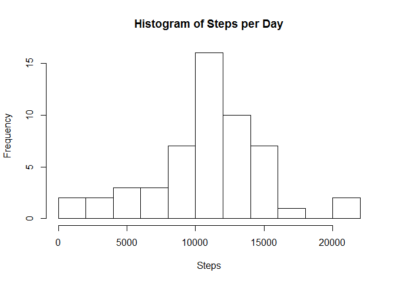
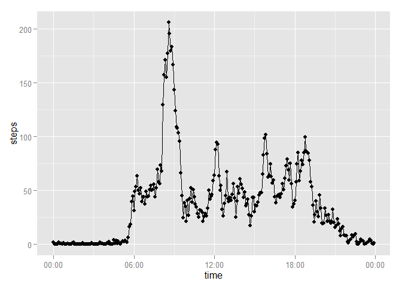
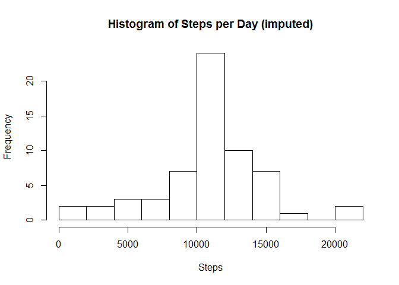
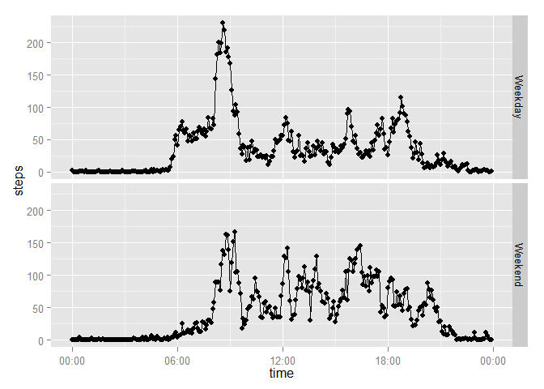

# Reproducible Research: Peer Assessment 1


## Loading and preprocessing the data

Before we begin, let's load some helpful libraries.

```r
library(dplyr)
```

```
## Warning: package 'dplyr' was built under R version 3.1.2
```

```
## 
## Attaching package: 'dplyr'
## 
## The following object is masked from 'package:stats':
## 
##     filter
## 
## The following objects are masked from 'package:base':
## 
##     intersect, setdiff, setequal, union
```

```r
library(ggplot2)
```

```
## Warning: package 'ggplot2' was built under R version 3.1.2
```

```r
library(lubridate)
```

```
## Warning: package 'lubridate' was built under R version 3.1.2
```

```r
library(scales)
```

```
## Warning: package 'scales' was built under R version 3.1.2
```

First, we extract the data.

```r
unzip("activity.zip")
```
Then, we load the data.

```r
data <- read.csv("activity.csv")
```
To make life easier, let's convert intervals to times on a 24 hour clock.

```r
times <- format(as.Date(minutes(seq(0, 1439, by = 5)), origin = origin), "%H:%M")
data <- cbind(data, time = times)
```

## What is mean total number of steps taken per day?

Let's examine the data.

```r
per_day <- data %>%
    group_by(date) %>%
    summarize(steps = sum(steps))
hist(per_day$steps, xlab = "Steps", main = "Histogram of Steps per Day", breaks = 10)
```

 

The mean of steps per day was:

```r
mean(per_day$steps, na.rm = T)
```

```
## [1] 10766.19
```
The median of steps per day was:

```r
median(per_day$steps, na.rm = T)
```

```
## [1] 10765
```

## What is the average daily activity pattern?

Let's examine the data by interval instead of by day.

```r
per_int <- data %>%
    group_by(time) %>%
    summarize(steps = mean(steps, na.rm = T))
with(per_int, qplot(parse_date_time(time, orders = "H:M"), 
                    steps, geom = c("point", "line"), stat = "identity", 
                    xlab = "time", group = 1) + 
         scale_x_datetime(labels = date_format("%H:%M")))
```

 

The interval with the highest average amount of steps was:

```r
with(per_int, time[which(steps == max(steps))])
```

```
## [1] 08:35
## 288 Levels: 00:00 00:05 00:10 00:15 00:20 00:25 00:30 00:35 00:40 ... 23:55
```

## Imputing missing values

The number of rows with missing data is:

```r
sum(is.na(data$steps))
```

```
## [1] 2304
```
For missing data, let's replace it with the mean for its interval. We'll save this to a 
column named 'steps_no_na'.

```r
data$steps_no_na <- mapply(data$time, data$steps, FUN = function(time, steps) 
    {
        if (is.na(steps)) per_int$steps[time] else steps
    })
```
Let's examine the data with imputed values.

```r
per_day_imputed <- data %>%
    group_by(date) %>%
    summarize(steps = sum(steps_no_na))
hist(per_day_imputed$steps, xlab = "Steps", main = "Histogram of Steps per Day (imputed)",
     breaks = 10)
```

 

The mean of steps per day (imputed) was:

```r
mean(per_day_imputed$steps)
```

```
## [1] 10766.19
```
The median of steps per day (imputed) was:

```r
median(per_day_imputed$steps)
```

```
## [1] 10766.19
```
By using the mean to compute imputed values, the mean did not change, but the median
shifted to be equal to the mean.

## Are there differences in activity patterns between weekdays and weekends?

Now let's add a column indicating whether the day was occurred during the week or during 
the weekend.

```r
data$day_type <- as.factor(mapply(data$date, FUN = function(date) 
    {
        if (wday(date) == 1 | wday(date) == 7) "Weekend" else "Weekday"
    }))
```

Finally, let's make a graph comparing step patterns on the weekend to those during weekdays.

```r
per_int_type <- data %>%
    group_by(time, day_type) %>%
    summarize(steps = mean(steps_no_na))
with(per_int_type, qplot(parse_date_time(time, orders = "H:M"), 
                    steps, geom = c("point", "line"), stat = "identity", 
                    data = per_int_type, facets = day_type ~ .,
                    xlab = "time", group = 1) + 
         scale_x_datetime(labels = date_format("%H:%M")))
```

 
